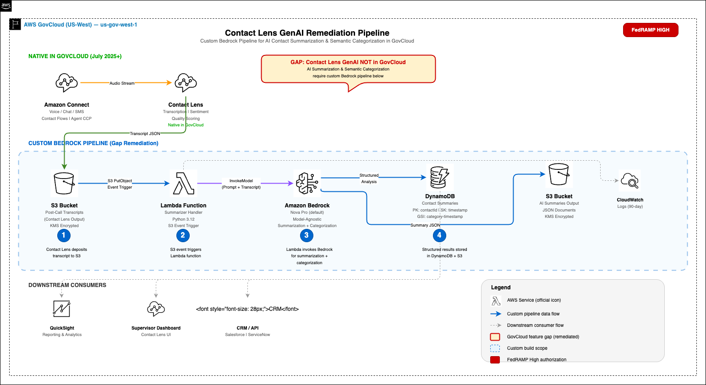

# Contact Lens GenAI Remediation Pipeline for AWS GovCloud

Custom Amazon Bedrock pipeline that replaces Contact Lens GenAI features (AI contact summarization and semantic categorization) not yet available in AWS GovCloud.

## The Problem

Contact Lens in GovCloud provides transcription, sentiment analysis, and quality scoring - but **GenAI features** like AI-powered contact summarization and semantic categorization are not yet available in the GovCloud partition.

## The Solution

A serverless, event-driven pipeline that runs entirely within the FedRAMP High boundary:

```
Amazon Connect -> Contact Lens -> S3 (transcript) -> Lambda -> Bedrock -> DynamoDB + S3 (summaries)
```

1. Contact Lens writes post-call analysis JSON to S3
2. S3 event notification triggers a Lambda function
3. Lambda invokes Amazon Bedrock (Nova Pro by default) for summarization and categorization
4. Structured results are stored in DynamoDB and S3

## Architecture



## What You Get

For each contact, the pipeline generates:

| Field | Description |
|-------|-------------|
| **Summary** | 2-3 sentence overview of the interaction |
| **Category** | Classification (Sales, Technical Support, Billing, etc.) |
| **Intent** | Caller's intent in 5 words or fewer |
| **Sentiment** | Positive, Neutral, Negative, or Escalated |
| **Disposition** | Resolved, Transferred, Callback Scheduled, or Unresolved |
| **Key Topics** | Array of topics discussed |
| **Follow-up** | Whether follow-up is required |

## Cost

~$0.001 per contact summary. 100K contacts/month costs roughly $100.

## Prerequisites

- AWS GovCloud account with Bedrock model access enabled
- Amazon Connect instance with Contact Lens enabled
- Terraform >= 1.5.0
- AWS CLI configured with a GovCloud profile

## Quick Start

```bash
# Clone
git clone https://github.com/rezaarchi/contact-lens-genai.git
cd contact-lens-genai

# Configure
cp terraform/terraform.tfvars terraform/terraform.tfvars.local
# Edit terraform.tfvars with your values (see Configuration below)

# Deploy
cd terraform
terraform init
terraform apply

# Test with sample transcript
aws --profile your-govcloud-profile s3 cp \
  sample/sample_transcript.json \
  s3://$(terraform output -raw transcript_bucket_name)/transcripts/sample_transcript.json

# Check results
aws --profile your-govcloud-profile dynamodb scan \
  --table-name $(terraform output -raw dynamodb_table_name)
```

## Configuration

Update `terraform/terraform.tfvars` with your values:

```hcl
aws_region         = "us-gov-west-1"
aws_profile        = "your-govcloud-profile"
project_name       = "contact-lens-genai"
environment        = "dev"
bedrock_model_id   = "amazon.nova-pro-v1:0"

# Amazon Connect - find with: aws connect list-instances
connect_instance_id = "your-connect-instance-id"
connect_s3_bucket   = "your-connect-s3-bucket-name"
connect_s3_prefix   = "connect/your-instance-alias/"
```

### Switching Bedrock Models

The pipeline is model-agnostic. Change `bedrock_model_id` to any available model:

| Model | ID |
|-------|-----|
| Amazon Nova Pro (default) | `amazon.nova-pro-v1:0` |
| Amazon Titan Text Premier | `amazon.titan-text-premier-v1:0` |
| Anthropic Claude Sonnet 4.6 | `us.anthropic.claude-sonnet-4-6` |
| Anthropic Claude Sonnet 4.5 | `us.anthropic.claude-sonnet-4-5-v2-20250929` |

## Connect Integration

The Lambda is triggered by S3 events, not by the contact flow directly. To integrate:

1. In your contact flow, add a **Set recording, analytics and processing behavior** block
2. Enable **Contact Lens conversational analytics** with **Post-call analytics** for voice
3. Set **Call recording** to record Agent and Customer
4. Save and publish the flow

After each call, Contact Lens writes analysis to S3, which automatically triggers the Lambda.

## Project Structure

```
.
├── terraform/           # Infrastructure as Code
│   ├── main.tf          # Provider config (us-gov-west-1)
│   ├── variables.tf     # All configurable variables
│   ├── terraform.tfvars # Your environment values
│   ├── s3.tf            # Transcript + summary buckets
│   ├── lambda.tf        # Summarizer function + S3 trigger
│   ├── dynamodb.tf      # Contact summaries table
│   ├── iam.tf           # Least-privilege roles
│   ├── connect.tf       # Connect S3 bucket integration
│   └── outputs.tf       # Resource ARNs and names
├── lambda/summarizer/
│   ├── handler.py       # Lambda handler (model-agnostic)
│   └── requirements.txt
└── sample/
    └── sample_transcript.json
```

## Cleanup

```bash
# Empty S3 buckets first
aws --profile your-govcloud-profile s3 rm \
  s3://contact-lens-genai-dev-transcripts-YOUR_ACCOUNT_ID --recursive
aws --profile your-govcloud-profile s3 rm \
  s3://contact-lens-genai-dev-summaries-YOUR_ACCOUNT_ID --recursive

# Destroy all resources
cd terraform
terraform destroy
```

## License

MIT
